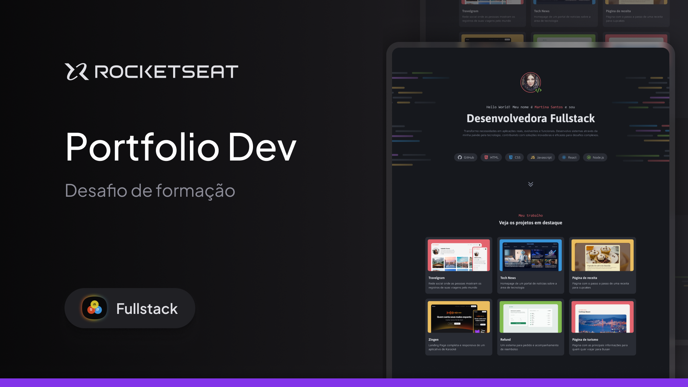

  <a href="#-tecnologias">Tecnologias</a>&nbsp;&nbsp;&nbsp;|&nbsp;&nbsp;&nbsp;
  <a href="#-projeto">Projeto</a>&nbsp;&nbsp;&nbsp;|&nbsp;&nbsp;&nbsp;
  <a href="#-layout">Layout</a>&nbsp;&nbsp;&nbsp;|&nbsp;&nbsp;&nbsp;
  <a href="#memo-licença">Licença</a>

 

  

 

  

## 🚀 Tecnologias

Esse projeto foi desenvolvido com as seguintes tecnologias:

- HTML
- CSS
- FIGMA

Bibliotecas

- [Google Fonts](https://fonts.google.com/)
- [Figma](https://www.figma.com/design/Sn5hHcrIY5iT0sk9aBIltb/Portfolio-Dev--Community-?node-id=915-685&t=jJrm91GtfpZz9tzH-0)

## 💻 Projeto

Neste desafio, você vai desenvolver um portfólio em HTML e CSS, com layout moderno e que apresenta sua identidade como desenvolvedor(a), suas principais habilidades e porjetos em destaque. O portfólio contará com uma seção de apresentação personalizada, tags de tecnologias que identificam sua stack e cards de projetos que exibem imagem, título e descrição.

- [Acesse o projeto finalizado, online]()

## 🔖 Layout

Você pode visualizar o layout do projeto através [desse link](https://www.figma.com/design/Sn5hHcrIY5iT0sk9aBIltb/Portfolio-Dev--Community-?node-id=915-685&t=jJrm91GtfpZz9tzH-0). É necessário ter conta no [Figma](https://figma.com) para acessá-lo.

## 📝 Licença

Esse projeto está sob a licença MIT.

---

Feito com ♥ by Rocketseat e replicado por Eddie :wave: [Participe da nossa comunidade!](https://discordapp.com/invite/gCRAFhc)

<!--START_SECTION:footer-->

 
 

  

<!--END_SECTION:footer-->